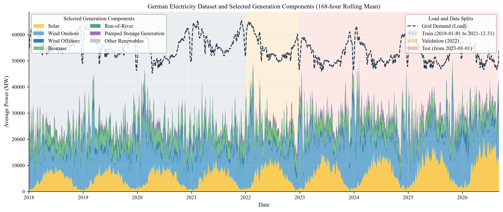
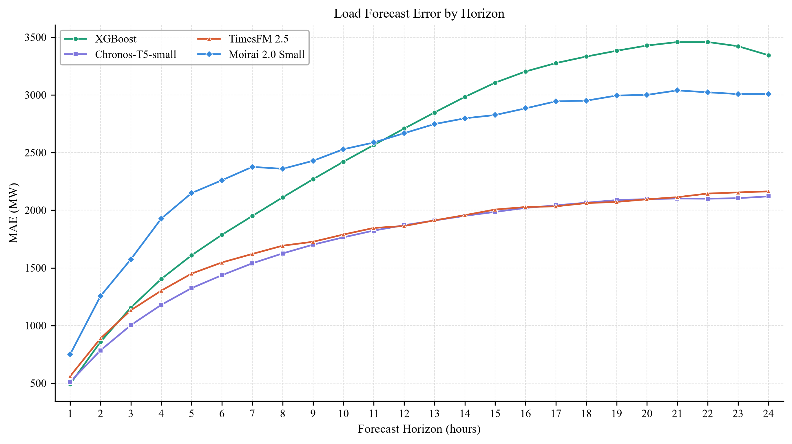
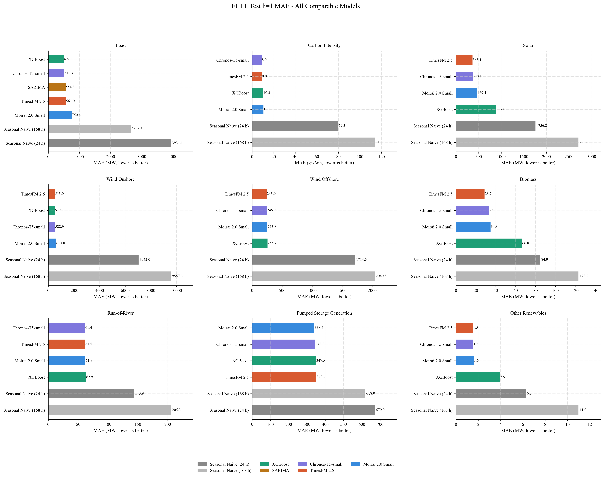
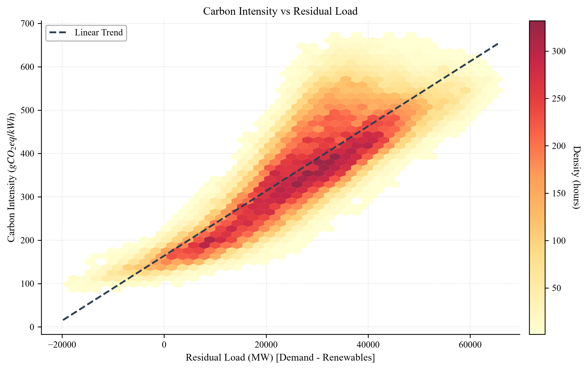

# Energy and Carbon Intensity Forecasting

A research-oriented forecasting framework for the German electricity system, combining open power-system data, weather observations, engineered time-series features, classical baselines, gradient boosting, and zero-shot time-series foundation models.

The project addresses two connected research questions:

1. **How do statistical, feature-based, and zero-shot foundation models compare when forecasting key German electricity-system variables over a 24-hour horizon?**
2. **How does the observed generation state of the system relate to production-based carbon intensity?**

In practical terms, the project asks which forecasting approaches work best for different parts of the electricity system, how their accuracy changes with forecast horizon, and when the German grid tends to be more or less carbon intensive.

The pipeline covers ingestion, hourly UTC alignment, feature engineering, chronological evaluation, multi-model benchmarking, and scientific visualization. The final benchmark spans nine targets and compares simple seasonal baselines, SARIMA, XGBoost, Chronos-T5-small, TimesFM 2.5, and Moirai 2.0 Small.

## What this project contributes

- A reproducible hourly German electricity dataset assembled from OPSD, SMARD, and Meteostat.
- A leakage-aware forecasting benchmark spanning nine electricity and carbon-intensity targets.
- A controlled comparison between seasonal/statistical baselines, feature-based XGBoost, and three zero-shot time-series foundation models.
- A common 24-hour forecast contract that makes short-horizon and horizon-wise model behavior directly comparable.
- An energy-system interpretation linking residual load, renewable generation, and a derived production-based carbon-intensity estimate.

## Key results

The final reported results use the **FULL** test benchmark. **MAE is the primary metric**, with RMSE secondary and R² supplementary. MAPE is not emphasized because zero and near-zero generation periods can make percentage errors unstable.

### Best h=1 MAE by target

| Target | Best model | MAE | Unit |
|---|---|---:|---|
| Load | XGBoost | 492.8 | MW |
| Solar | TimesFM 2.5 | 365.1 | MW |
| Wind Onshore | TimesFM 2.5 | 513.0 | MW |
| Wind Offshore | TimesFM 2.5 | 243.9 | MW |
| Biomass | TimesFM 2.5 | 28.7 | MW |
| Run-of-River | Chronos-T5-small | 61.4 | MW |
| Pumped Storage Generation | Moirai 2.0 Small | 338.4 | MW |
| Other Renewables | TimesFM 2.5 | 1.5 | MW |
| Carbon Intensity | Chronos-T5-small | 8.9 | gCO₂eq/kWh |

No single model dominates all nine targets.

For load, XGBoost is strongest at **h=1**, but the horizon analysis shows a different longer-range picture. Its recursive error grows faster across the 24-hour rollout, while Chronos-T5-small and TimesFM 2.5 remain substantially more stable at longer horizons. This is why the project reports both an all-model h=1 leaderboard and horizon-wise error from h=1 to h=24.

## Pipeline

```text
OPSD / SMARD / Meteostat
          |
          v
Hourly UTC merge and source validation
          |
          v
Feature engineering and chronological splits
          |
          +----------------------------+
          |                            |
          v                            v
Seasonal / SARIMA / XGBoost      Chronos / TimesFM / Moirai
          |                            |
          +-------------+--------------+
                        |
                        v
            Common evaluation contract
                        |
                        v
             Metrics and scientific plots
```

The notebook workflow is:

1. `01_data_ingestion.ipynb` - ingestion, merging, source checks
2. `02_feature_engineering.ipynb` - calendar, weather, lag, rolling, and difference features
3. `03_baselines.ipynb` - seasonal-naive, SARIMA, and XGBoost baselines
4. `04_foundation.ipynb` - Chronos, TimesFM, and Moirai zero-shot benchmark

Exported figures are stored under `docs/figures/`

## Data and forecast targets

The project combines three open data sources:

- **Open Power System Data (OPSD)** - German load and renewable generation
- **SMARD / Bundesnetzagentur** - German electricity-system and generation data
- **Meteostat** - historical weather observations

All sources are aligned to a continuous hourly UTC index.

The nine forecast targets are:

- Load
- Solar
- Wind Onshore
- Wind Offshore
- Biomass
- Run-of-River
- Pumped Storage Generation
- Other Renewables
- Carbon Intensity

Carbon intensity is a **derived production-based estimate**, calculated from the German generation mix using fixed lifecycle-emission factors and source-completeness checks. It is not an official measured carbon-intensity series and should not be interpreted as a consumption-based measure that fully accounts for cross-border electricity flows.

For the hourly SMARD generation targets stored in MWh, one-hour energy values are numerically equivalent to average MW over that hour for the plots and benchmark presentation.

## Benchmark design

### Chronological split

- **Training:** through 2021-12-31
- **Validation:** 2022
- **Test:** from 2023-01-01 onward

The split boundaries are mutually exclusive and no shuffling is used.

### Forecast contract

The main benchmark uses:

- 24-hour forecast horizon
- common forecast timestamps
- h=1 in prediction column 0
- h=24 in prediction column 23
- `(N, 24)` multi-horizon prediction arrays
- FULL and QUICK runs stored separately

For the zero-shot foundation models:

- 168-hour target-history context
- univariate target history only
- no engineered features
- no future target observations
- common forecast origins and timestamps across Chronos, TimesFM, and Moirai

The final h=1 comparable benchmark contains **55 model-target results**:

| Model | Final target coverage |
|---|---:|
| Seasonal Naive 24 h | 9 / 9 |
| Seasonal Naive 168 h | 9 / 9 |
| XGBoost | 9 / 9 |
| SARIMA | 1 / 9 (Load only) |
| Chronos-T5-small | 9 / 9 |
| TimesFM 2.5 | 9 / 9 |
| Moirai 2.0 Small | 9 / 9 |

## Models

### Simple and statistical baselines

**Seasonal Naive (24 h / 168 h)** provides daily and weekly reference forecasts.

**SARIMA** is evaluated as a rolling-origin statistical baseline. In the final FULL benchmark it is included for **Load only**.

### XGBoost

XGBoost is the feature-based machine-learning baseline.

It is trained as a one-step model and recursively rolled forward to 24 hours. Its inputs include causal target-history features, calendar features, and forecast-origin weather information. During recursive rollout:

- target lag, rolling, and difference features are rebuilt from a consecutive history buffer;
- calendar features advance to each forecast timestamp;
- unknown future weather is represented by persistence from the forecast origin.

This makes XGBoost intentionally different from the target-only zero-shot foundation models.

### Foundation models

The project evaluates three pretrained time-series foundation models in zero-shot mode:

- **Chronos-T5-small**
- **TimesFM 2.5**
- **Moirai 2.0 Small**

All three receive the same 168-hour target context and predict the same 24-hour horizon.

Their q10, q50, and q90 outputs are also persisted when genuinely available. These quantiles are used descriptively; formal calibration ranking is outside the scope of the benchmark.

## Results

### German electricity dataset and selected generation components

The overview below shows load, selected generation components, and the chronological train/validation/test periods. The stacked generation areas are **selected components**, not the complete German generation mix used elsewhere in the data pipeline.



### Load forecast error by horizon

This is the main multi-horizon comparison for load. XGBoost is strongest at the first forecast step, but its recursive error rises more quickly as the horizon increases. Chronos-T5-small and TimesFM 2.5 degrade more slowly across the 24-hour window.



### Multi-target FULL h=1 benchmark

The h=1 leaderboard gives the broadest common comparison across model families, including SARIMA for Load. Each target is ranked independently by MAE because the targets have different physical scales.



### Carbon intensity and residual load

Residual load is defined here as electricity demand minus the selected renewable generation components used in the analysis. Lower residual load tends to coincide with lower carbon intensity in this dataset.

This is an observed association, not a causal claim.



## Methodological safeguards

The project includes several controls intended to keep the benchmark reproducible and leakage-aware:

- target lags, rolling statistics, and difference features use historical values only;
- same-hour regional load variables and raw observed wind generation are excluded from the canonical XGBoost feature set;
- the observed-generation-derived `clearsky_index` remains diagnostic only and is excluded from model features;
- feature missingness decisions are learned from the training period;
- chronological splits are mutually exclusive;
- XGBoost recursive history is rebuilt from a complete consecutive target buffer;
- forecast timestamps use one explicit h=1...h=24 alignment convention;
- QUICK and FULL runs are stored separately;
- metric records are upserted/deduplicated rather than blindly appended.

## Running the project

Python 3.12 is recommended for the tested dependency stack.

### 1. Create an environment

```bash
python -m venv .venv
```

Activate it using the command appropriate for your operating system, then install:

```bash
python -m pip install -r requirements.txt
```

### 2. Run the workflow

Execute the notebooks in order:

```text
01_data_ingestion.ipynb
02_feature_engineering.ipynb
03_baselines.ipynb
04_foundation.ipynb
```

Use **QUICK** first as an integration/smoke test. Use **FULL** for final benchmark results.

The final reported results in this README are from FULL evaluation only.

### CPU and CUDA

Foundation-model adapters support CPU execution and NVIDIA CUDA when available. CUDA is selected only when the active PyTorch installation reports it as available.

GPU memory primarily affects usable batch size; reducing batch size is preferable to silently changing the benchmark.

## Optional Moirai compatibility

Moirai requires `uni2ts==2.0.0`.

Where Uni2TS is compatible with the installed PyTorch stack, all foundation models can run in the same environment.

```bash
python -m pip install "uni2ts==2.0.0"
```

If Uni2TS conflicts with the main PyTorch environment, Notebook 04 supports an optional neutral artifact-handoff workflow:

1. build the common benchmark contexts and timestamps in the main project runtime;
2. export neutral Moirai benchmark inputs;
3. run Moirai in any compatible environment;
4. restore the validated output artifacts into the main evaluation path.

The separate runtime is therefore a compatibility fallback, not a requirement of the scientific benchmark.

## Methodological limitations

The benchmark should be interpreted with the following constraints:

- **Different information sets:** XGBoost uses engineered historical, calendar, and weather features, while the foundation models are zero-shot and target-only.
- **Future weather assumption:** recursive XGBoost persists weather observed at the forecast origin when future weather values are unavailable.
- **Carbon-intensity scope:** the carbon target is a production-based derived proxy rather than an official consumption-based grid-intensity measure.
- **Probabilistic outputs:** q10/q50/q90 intervals are presented descriptively; the project does not claim a formal probabilistic calibration ranking.
- **Research scope:** the framework is designed for reproducible comparative forecasting, not as a production-grade operational forecasting service.

## Data sources

- [Open Power System Data](https://open-power-system-data.org/)
- [SMARD / Bundesnetzagentur](https://www.smard.de/)
- [Meteostat](https://meteostat.net/)

## Repository outputs

Main generated artifacts include:

- merged hourly data
- feature-engineered data
- model checkpoints
- QUICK and FULL prediction artifacts
- baseline and foundation-model metric registries
- horizon-wise evaluation outputs


## Summary

This project shows that model ranking depends strongly on both the **target** and the **forecast horizon**.

XGBoost is the strongest h=1 model for Load, while zero-shot foundation models are highly competitive despite using only target history. TimesFM 2.5 leads several renewable-generation targets at h=1, Chronos-T5-small is consistently strong and leads Carbon Intensity, and Moirai 2.0 Small performs best on Pumped Storage Generation.

The 24-hour load horizon analysis is especially important: the feature-based recursive model has the strongest first step, but Chronos and TimesFM remain more stable as the forecast horizon grows.

The main achievement is therefore not a single winning model, but a reproducible benchmark in which different forecasting paradigms can be compared under explicit information assumptions. The results show that different approaches excel under different targets, horizons, and information settings, while the carbon-intensity analysis connects forecast performance back to the physical behavior of the electricity system.
